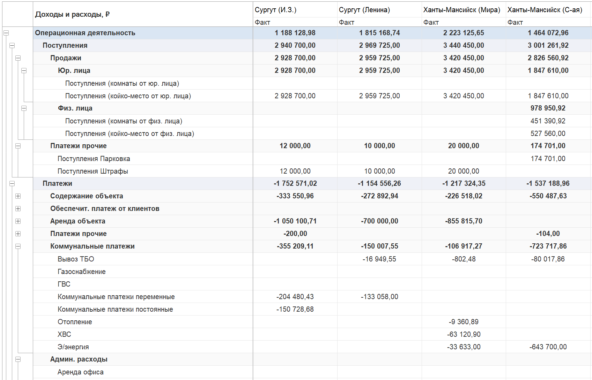
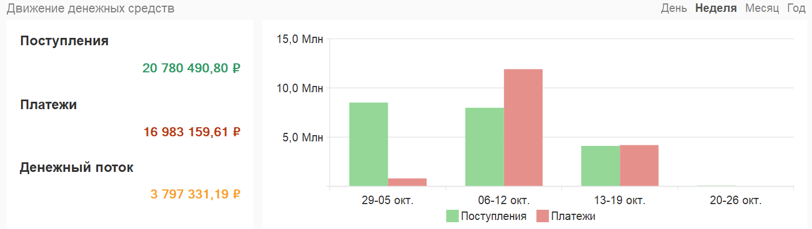
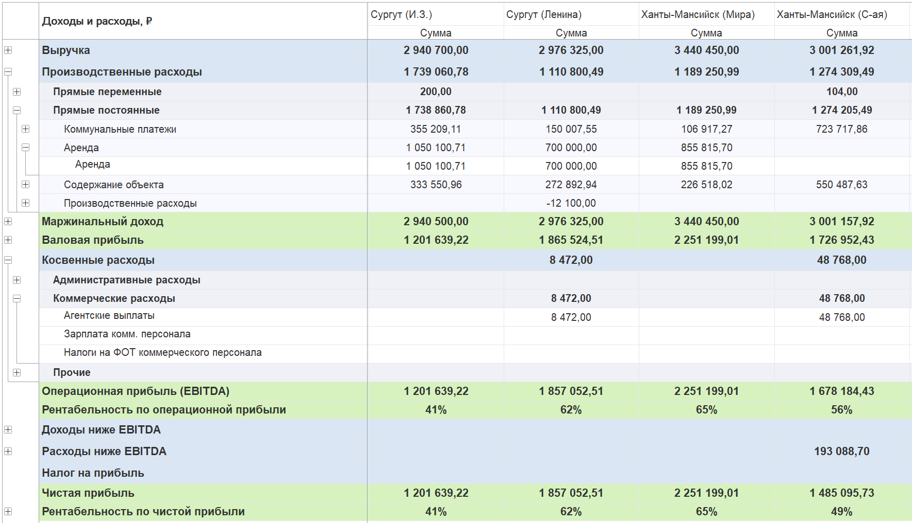
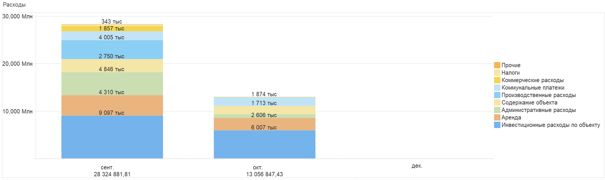

Один из клиентов «**P&L для 1С предприятия**» - компания, управляющая коммерческой и жилой недвижимостью (отели, апартаменты, помещения). Учет велся в отраслевом решении «**Аренда и управление недвижимостью для 1С:Бухгалтерия предприятия 8**» (ред. 3.0), которое эффективно справлялось с операционными задачами: договорами, начислениями и расчетами с арендаторами.

## С чем столкнулся клиент: ключевые финансовые проблемы, тормозившие развитие

Однако для управления финансами компании требовалась более глубокая аналитика:

-  Детализированная отчетность: Формирование отчета о движении денежных средств (ДДС) и отчета о прибылях и убытках (ОПиУ) не только в целом по компании, но и в разрезе каждого объекта недвижимости.

-  Учет по кассам: Получение данных по отдельным кассам, привязанным к разным зданиям, что не поддерживалось стандартной конфигурацией 1С.

-  Автоматизация: Исключение ручного сбора данных и повышение скорости формирования управленческой отчетности.

## Решение: автоматизация учета в P&L для 1С:Предприятия

Для решения этих задач была внедрена наша универсальная система P&L для 1С:Предприятие с дополнительными доработки и настройками.

:::info 

Модуль **P&L для 1С:Предприятие** -- это универсальное и гибкое расширение для систем 1С. Оно легко внедряется и подходит для различных конфигураций: **Бухгалтерия предприятия**, **Управление торговлей**, **Управление нашей фирмой**, **ERP**, а также более узкоспециализированных отраслевых решений, например: **Аренда и управление недвижимостью для 1С**.

Благодаря своей гибкости модуль может быть интегрирован практически в любую конфигурацию 1С, обеспечивая удобный и мощный инструмент для работы с финансовыми данными, ДДС, ОПиУ и баланс.

:::

### ДДС на новом уровне: гибкий, глубокий и полностью автоматизированный отчет

Что было реализовано:

-  Создана многоуровневая иерархия статей движения денежных средств для детальной аналитики.

-  Внедрена система дополнительной аналитики, позволяющая разносить все банковские и кассовые операции по конкретным объектам (здания, помещения, отели).

-  Реализован учет по отдельным кассам. Теперь клиент видит точные остатки и движение средств в разрезе каждой точки приема платежей.

{width=1696px height=1090px}

{width=1432px height=405px}

:::info 

[В нашей статье в документации вы найдете подробное описание, как ведется учет по отдельным кассам.](./../p-l/dengi/uchet-denezhnykh-sredstv-po-terminalam-kassam)

:::

### ОПиУ с максимальной детализацией: доходы распределяются сами, ошибки исключены

Что было реализовано:

-  В специализированные документы «Счет на аренду» и «Начисление арендной платы» добавлены специальные реквизиты P&L для привязки доходов к объектам недвижимости.

-  Внедрена автоматическая подстановка статей доходов при выборе услуги аренды, что исключило ручной ввод и ошибки сотрудников.

-  Обеспечен корректный учет доходов по периодам оказания услуг. Например, начисленная разово арендная плата за два месяца автоматически распределяется в отчете ОПиУ по месяцам.

{width=1769px height=1017px}

{width=2100px height=627px}

### Единая финансовая среда: вся аналитика бизнеса в одном окне

-  Все финансовые операции (начисления, оплаты, расходы) теперь ведутся в едином разрезе объектов и подразделений.

-  Отчеты формируются как в сводном виде по юрлицу, так и с любой степенью детализации -- вплоть до отдельного помещения и кассы.

## Финансовый результат: прозрачность, скорость и полный контроль над денежными потоками

Клиент получил полностью автоматизированную систему финансового учета, тесно интегрированную с его основной операционной системой.

-  Управленческая отчетность (ДДС, ОПиУ) формируется быстро, точно и с необходимой детализацией.

-  Появился полный контроль над денежными потоками по каждому объекту и кассе.

-  Сотрудники работают в привычном интерфейсе 1С без увеличения рутинной нагрузки -- вся аналитика заполняется автоматически.

Внедрение системы P&L позволило клиенту перейти на качественно новый уровень управления бизнесом. Финансовая картина стала абсолютно прозрачной, что позволяет руководству принимать взвешенные и своевременные управленческие решения на основе актуальных данных.