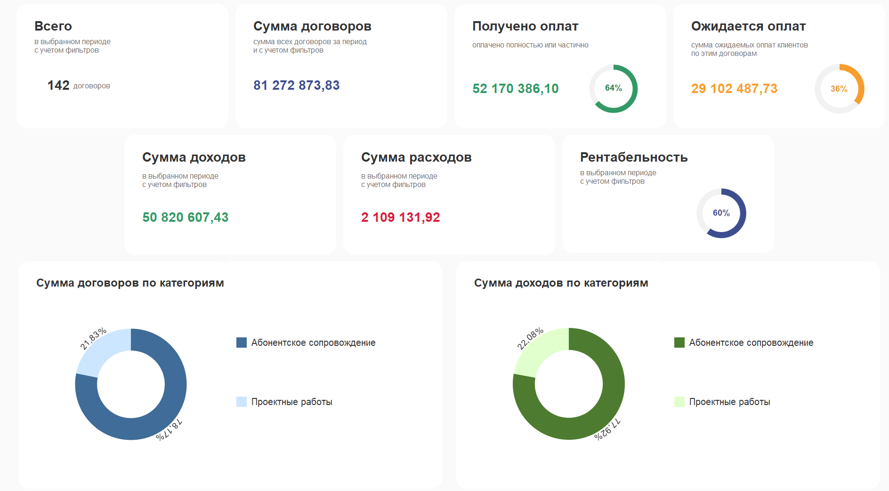
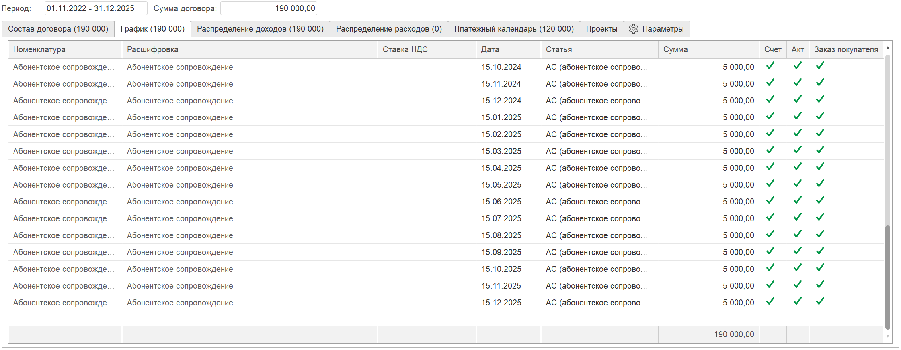
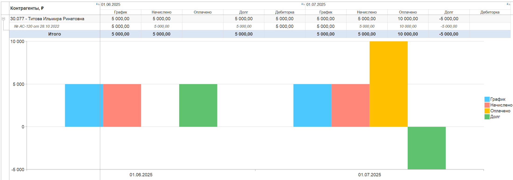
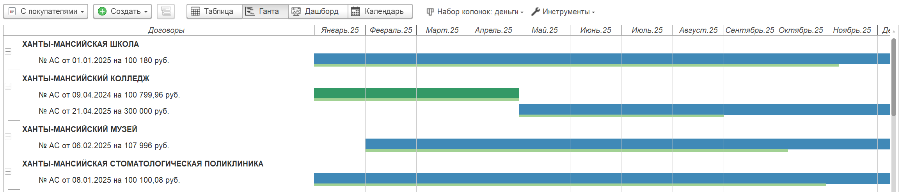

Для компаний, которые оказывают услуги на ежемесячной основе, одна из самых важных задач -- это контроль договоров. Нужно вовремя выставлять акты и счета, следить за сроками окончания контрактов, понимать, кто оплатил, а кто задерживает платежи, и не потерять клиента из-за простой организационной ошибки.

В нашей компании «Хорошие Люди» одно из основных направлений -- абонентское сопровождение 1С. Клиентов у нас больше сотни, среди них и коммерция, и госсектор. И наша стабильность напрямую зависит от того, насколько мы точно выполняем весь цикл: оказали услуги -> выставили документы -> получили оплату -> не забыли продлить договор.

Когда договоров было 15–20, всё решалось Excel-таблицей и внимательностью менеджера. Но как только их стало больше сотни -- система дала сбой.

## **Проблема: рутина, долги и риск потерять клиента**

Рано или поздно любая компания, работающая по абонентскому сопровождению, сталкивается с тремя ключевыми болями:

-  **Потерянные счета и акты -** Менеджер мог просто забыть выставить документы в нужный месяц.\
   В итоге: услуги оказаны, время потрачено -- а денег нет.

-  **Непрозрачные оплаты.** Чтобы понять, кто оплатил, кто задолжал, приходилось бесконечно сверяться с выписками. Долги обнаруживались слишком поздно.

-  **Пропуск окончания договора.** Самая опасная история. Если вовремя не продлить договор, особенно в госсекторе, можно потерять клиента на целый год из-за неподанного бюджета.

Когда договоров стало больше ста, стало очевидно: вести всё это вручную -- значит постоянно рисковать. Нам нужна была система, которая возьмёт рутину на себя.

## **Задача: полный контроль над договорами**

Были сформулировали требования:

-  **Автоматизация** -- акты и счета должны формироваться без ручной рутины.

-  **Контроль оплат** -- видеть начисления, оплаты и долги в одном месте.

-  **Сроки договоров** -- не пропускать даты окончания и вовремя инициировать пролонгацию.

-  **Прозрачность структуры договора** -- чтобы любой сотрудник понимал, какие услуги и на каких условиях.

-  **Финансовая аналитика** -- видеть плановые доходы, расходы и рентабельность.

И всё это должно работать в связке с бухгалтерией 1С.

{width=1888px height=1045px}

## **Решение: как это реализовано в P&L для 1С**

### **Учет по договорам -- теперь это полноценная система**

Справочник договоров в P&L превратился в центр управления всем процессом.\
Во вкладке **«Сведения по P&L»** собирается ключевая информация:

-  статус договора -- в работе, подписан, завершён;

-  способ обмена документами -- Диадок, 1С-ЭДО, курьер;

-  категория договора -- абонентка, проекты, продажи;

-  срок действия;

-  сумма;

-  плановые доходы и расходы.

{width=2251px height=837px}

Вся информация -- в одном месте, ничего больше не «живет» в Excel.

### **Состав договора и график выставления документов**

В карточку договора мы заносим:

-  какие услуги оказываем;

-  расшифровку с шаблонами периодов (типа «за прошлый месяц»);

-  статьи ДДС;

-  цены и суммы;

-  период действия.

   {width=2253px height=924px}

На основании этих данных система автоматически формирует **график актов и счетов** на все месяцы вперед.

{width=2241px height=873px}

### **Выставление счетов -- теперь это одна кнопка**

Каждый месяц бухгалтер открывает инструмент **«Формирование актов и счетов»**.\
Система сама показывает всех клиентов, которым в этом месяце нужны документы.

Дальше всё просто:

Выделить -> **Создать документы** -> готово.

Ни один клиент не потеряется. Никаких пропусков и человеческого фактора.

{width=2257px height=319px}

### **Все долги -- как на ладони**

Отчет **«Начисления и оплаты контрагентов»** стал одним из самых используемых.\
В нем видно:

-  что должны были начислить,

-  что начислили по факту,

-  что оплачено,

-  какой долг,

-  по какому месяцу и у какого клиента.

{width=2197px height=774px}

Больше нет необходимости искать информацию вручную -- вся картина перед глазами.

### **5\. Диаграмма Ганта -- главный инструмент по контролю сроков**

Когда менеджер открывает диаграмму Ганта, он сразу видит:

-  какие договоры подходят к завершению,

-  сколько времени осталось до окончания,

-  где нужно заранее связаться с клиентом.

{width=2307px height=496px}

Теперь мы не подходим к сроку в последний момент. Мы видим всё за 2–3 месяца и заранее инициируем продление.

## **Итог: что мы получили в результате**

Внедрение учета по договорам в P&L для 1С полностью изменило процесс:

-  **100% исключили пропуски** в выставлении актов и счетов.

-  **Снизили до нуля риски потери клиента** из-за непродленного договора.

-  **Получили прозрачную картину оплат и задолженности.**

-  **Сэкономили огромное количество времени** менеджеров и бухгалтеров.

-  **Повысили финансовую предсказуемость** и качество управленческого учета.