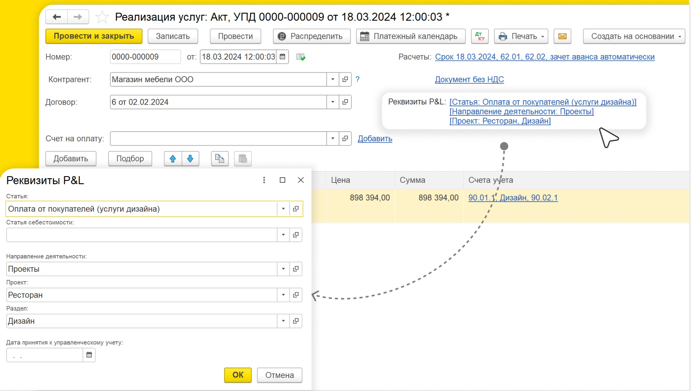

EBITDA (она же операционная прибыль) - прибыль компании до вычета налогов, процентов по кредитам и амортизации. Она показывает финансовый результат в ходе основной деятельности компании.

#### Формула расчета EBITDA:

:::info:true EBITDA = Выручка – Постоянные расходы − Переменные расходы

Где:

-  «**Выручка**» представляет собой общий доход, полученный от продажи товаров или услуг.

-  «**Переменные расходы**» это те, которые увеличиваются или уменьшаются в зависимости от объема производства, объема продаж или объема оказанных услуг.

-  «**Постоянные расходы**» это все остальные затраты, которые есть у предприятия и напрямую не завязаны на объеме производства.

:::

## **Считаем EBITDA.**

В модуле 1С:P&L операционную прибыль можно рассчитать с помощью отчета ОПиУ. В месте с этим вы узнаете множество других важных финансовых показателей. Для этого потребуется сделать несколько простых действий.

### Шаг 1. Настроить структуру отчета ОПиУ

Структура - основа отчета. Она состоит из групп, статей и рассчитываемых показателей. При установке модуля создается типовая структура отчета, которую можно взять за основу.

[image:./kak-poschitat-EBITDA.jpeg::Структура отчета P&L:0,0,100,100:89:square,1.4836,77.6733,30.0422,3.6428,,top-left:1814px:1431px]

По «классике» отчет ОПиУ собирается методом начислений. Однако жизнь предпринимателя несколько сложнее и иногда при расчете чистой прибыли опираться на другую информацию.

Уникальность модуля P&L в том, что по каждой статье можно указать свой метод получения данных:

1. **метод «Начисление»** - собирает [comment:b5VkT]данных[/comment] из бухгалтерских документов (накладные, акты, реализации, отчет о розничных продажах и др.)

2. **метод «Кассовый»** - собирает данные из документов движения денег (банк, касса, \*кошелек)

3. **метод «Бюджет»** - берет плановые данные из управленческого документа «Бюджет»

4. **метод «Договор»** - берет данные из договора (в каждом договоре есть таблицы с доходами и расходами)

Когда собрана структура отчета в нее следует добавить [comment:RXAsZ]рассчетные[/comment] показатель «Операционная прибыль».

[image:./kak-poschitat-EBITDA-2.jpeg:::0,0,100,100:52:1120px:836px]

### **Шаг 2. [comment:1Sz4r]Обработать[/comment] бухгалтерские документы**

В каждом документе движения денежных средств и исполнения обязательств *(поступления, реализации, акты, отчеты о розничных продажах и тд.)* необходимо выбрать соответствующую статью.

{width=2281px height=1292px}

### **Шаг 3. Внести недостающие доходы и расходы**

В модуле P&L предусмотрены различные инструменты для внесения управленческой информации:

-  Документ **«Кошелек»** - позволяет отразить поступления и оплаты по кошелькам предпринимателя, отсутствующих в бухгалтерском учете.

-  Документ **«Управленческая операция»** - позволяет отразить дополнительные доходы и расходы, отсутствующие в бухгалтерском учете.

-  Документ **«Основные средства»** - позволяет учитывать основные средства и их амортизацию, когда управленка расходится с бухгалтерским учетом.

-  Документ **«Бюджет»** - позволяет отразить доходы и расходы по статьям на определенный месяц.

:::tip Где это может пригодиться?

1. Например, вы [comment:RKjiT]заниматесь[/comment] проектной деятельностью и делите расходы на заработную плату сотрудников по проектам. В документе **«Управленческая операция»** можно отразить выплату заработной платы по разным статьям (оклад, премия, НДФЛ и др) с разделением по проектам.

2. Например, вам необходимо рассчитаться наличными за поставку материалов или услуг. С помощью документа **«Кошелек»** можно отразить движение денег по управленческому учету. Остатки по кошелькам тоже будут фигурировать в отчете ДДС.

3. Например, вы приобрели основное средство и хотите разделить затраты на три месяца. В документе **«Основные средства»** можно указать информацию об основном средстве и периода распределения расходов. Данные попадут в отчеты P&L и баланс.

:::

### **Шаг 4. Сформировать отчет**

В отчете P&L следует выбрать [comment:PtkVo]период,  структуру отчета[/comment] и нажать кнопку “Сформировать”.

[image:./kak-poschitat-EBITDA-4.jpeg::Отчет P&L:0,0,100,100::square,3.4792,67.0975,96.1994,4.7004,,top-left:2754px:2039px]