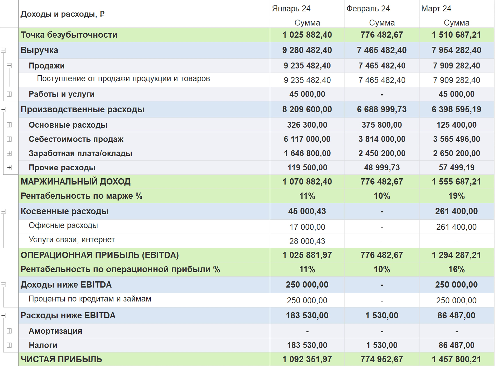

Чистая прибыль - это ключевой финансовый показатель, который позволяет определить реальную прибыль, оставшуюся у предпринимателя после всех вычетов и расходов.

#### Формула расчета чистой прибыли:

:::info Чистая прибыль = Выручка – Расходы − Налоги − Кредиты − Амортизация

Где:

-  «**Выручка**» представляет собой общий доход, полученный от продажи товаров или услуг.

-  «**Расходы**» включают в себя все издержки компании, кроме прибыли (дивидендов) собственника и вложений на развитие.

-  «**Налоги**» представляют собой сумму, которую компания должна уплатить в виде налогов и других обязательных платежей.

-  «**Кредиты**» это расходы на облуживание кредита - проценты, а не само тело кредита.

-  «**Амортизация**» это расходы на преобретение основных средств, которые компания распределяет по периоду его использования.

:::

## **Считаем чистую прибыль.**

В модуле 1С:P&L чистую прибыль можно рассчитать с помощью отчета ОПиУ. В месте с этим вы узнаете множество других важных финансовых показателей. Для этого подтребуется сделать несколько простых действий.

### Шаг 1. Настроить структуру отчета ОПиУ

Структура - основа отчета. Она состоит из групп, статей и рассчитываемых показателей. При установке модуля создается типовая структура отчета, которую можно взять за основу.

[image:./kak-poschitat-chistuyu-pribyl-2.jpeg::Структура отчета P&L:0,0,100,100:64::1466px:1491px]

По «классике» отчет ОПиУ собирается методом начислений. Однако жизнь предпринимателя несколько сложнее и иногда при расчете чистой прибыли опираться на другую информацию.

Уникальность модуля P&L в том, что по каждой статье можно указать свой метод получения данных:

-  **метод «Начислений»** - собирает данных из бухгалтерских документов (накладные, акты, реализации, отчет о розничных продажах и др.)

-  **метод «Кассовый»** - собирает данные из документов движения денег (банк, касса, \*кошелек)

-  **мет*од «Бюджет»*** *\- берет плановые данные из управленческого документа «Бюджет»*

-  ***метод «Договор»** \- берет данные из договора (в каждом договоре есть таблицы с доходами и расходами)*

:::tip Где это может пригодиться?

1. Например, вы занимаетесь оказанием профессиональных услуг на ежемесячной основе (консалтинг, частая школа и др). Вы можете запланировать доходы по каждому договору на каждый месяц и с помощью **метода «Договор»** брать эти данные для расчета прибыли. По бухгалтерскому учету может быть один акт, а по управленческому учету доходы будут распределены по месячно.

2. Например, вы держите часть свободных денежных средств на депозите и получаете ежемесячный процент. По статье «Процент по вкладам» можно использовать **метод «Кассовый»** и доход попадет в месяц поступления денежных средств на счет.

3. Например, у вас сеть ресторанов и вы регулярно оплачиваете коммунальные услуги. С помощью управленческого документа «Бюджет» можно каждый месяц заносить расходы по свету, газу и отоплению не дожидаясь актов и оплаты. Если указать по статьям таких услуг **метод «Бюджет»**, то расходы будут учитываться на основании данных управленческих документов.

:::

Когда собрана структура отчета в нее следует добавить рассчетные показатели , такие как «Валовая прибыль», «Операционная прибыль» и «Чистая прибыль». По каждому из показателей задается произвольная формула.

:::info 

*Например, Валовая прибыль = \[ВЫРУЧКА\] - \[ПРОИЗВОДСТВЕННЫЕ\_РАСХОДЫ\]*

:::

### **Шаг 2. Обработать бухгалтерские документы**

В каждом документе движения денежных средств и исполнения обязательств *(поступления, реализации, акты, отчеты о розничных продажах и тд.)* необходимо выбрать соответствующую статью.

[image:./kak-poschitat-chistuyu-pribyl-3.jpeg:::0,0,100,100::square,53.0603,28.3196,37.1765,8.4606,,top-left:2102px:1224px]

В случае, если по бухгалтрескому учету необходимо оставить одну статью, а по управленческому учету использовать другую существует механизм ручного распределения.

*Например, у вас строительный бизнес. <описать кейс НОДО с делением входящих денег по разным татьям>*

### **Шаг 3. Внести недостающие доходы и расходы**

В модуле P&L предусмотрены различные инструменты для внесения управленческой информации:

-  Документ «Кошелек» - позволяет отразить поступления и оплаты по кошелькам предпринимателя, отсутствующих в бухгалтерском учете.

-  Документ «Управленческая операция» - позволяет отразить дополнительные доходы и расходы, отсутствующих в бухгалтерском учету.

-  Документ «Основные средства» - позволяет учитывать основные средства и их амортизацию, когда управленка расходится с бухгалтерским учетом.

-  Документ «Бюджет» - ...

**Где это может пригодиться?**

*Например, вы заниматесь проектной деятельностью и делите расходы на заработную плату сотрудников по проектам. В документе «Управленческая операция» можно отразить выплату заработной платы по разным статьям (оклад, премия, и др) с разделением по проектам.*

*Например, вы приобрели основное средство и хотите разделить затраты на три месяца.*

### **Шаг 4. Сформировать отчет**

{width=2050px height=1524px}