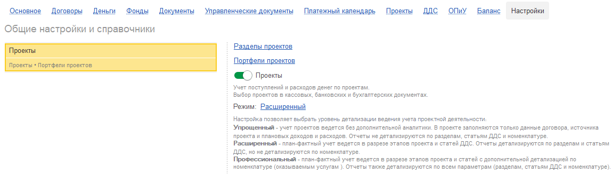
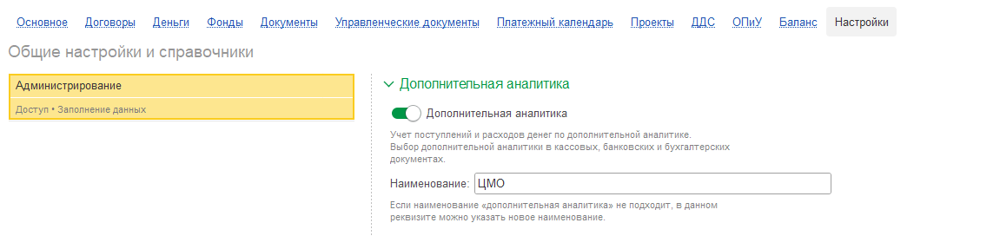
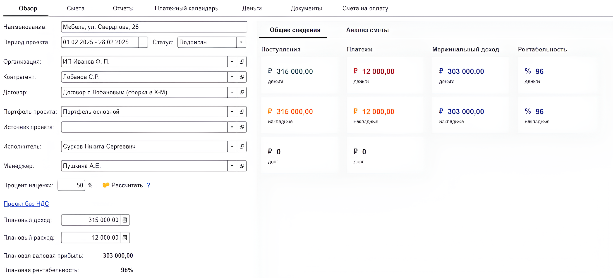
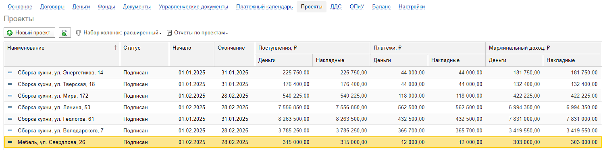
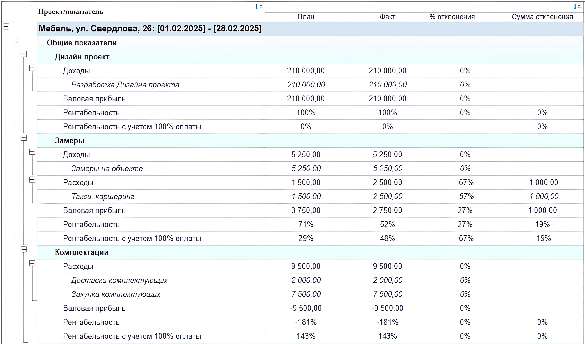
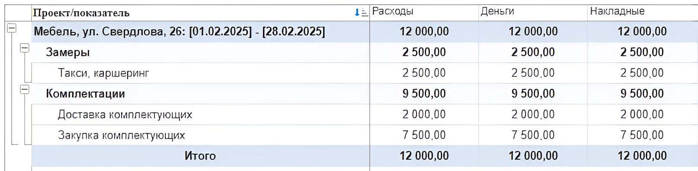
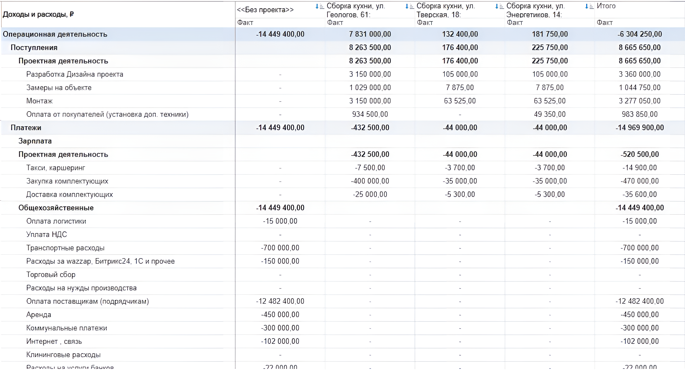

Как и многие в мебельном бизнесе, наш клиент работает по проектам: каждый заказ -- это уникальный продукт со своими этапами: **дизайн, производство, доставка, монтаж и пост-обслуживание**.

До нашего прихода они видели общую прибыль по компании в конце месяца, но не могли ответить на ключевые вопросы:

-  Какой проект был по-настоящему прибыльным, а какой -- нет?

-  Какой этап съедает основную маржу: может, дорого обходится установка или логистика?

-  Соответствуют ли фактические расходы на материалы и зарплату запланированной смете?

-  Какое подразделение работает эффективнее других?

Они управляли финансами, но не управляли **рентабельностью**. Это и был их главный вызов.

### **Решение: гибкая система проектного учета в P&L**

Мы предложили им нашу систему P&L для «1С:Предприятие», заточенную под проектный подход. Но главное -- мы не стали предлагать шаблонное решение. Вместо этого мы начали с глубокого обсуждения, чтобы выбрать оптимальный уровень детализации.

Мы объяснили, что есть три пути:

1. **Упрощенный режим:** Проект как «единая сделка». Видна общая рентабельность заказа, но непонятно, *где именно* она была заработана или потеряна.

2. **Расширенный режим:** Детализация **до этапов проекта и статей затрат**. Можно увидеть рентабельность этапа «Производство», понять, сколько потратили на материалы для «Монтажа» и сравнить план с фактом.

3. **Профессиональный режим:** Детализация **до каждой конкретной номенклатуры** (винт, панель, м² ткани). Максимальная точность, но и максимальная нагрузка на персонал по ручному внесению данных.

### **Совместный выбор: Золотая середина**

Клиент сначала хотел максимальную детализацию. Но мы честно предупредили: «Профессиональный» режим -- это не только мощная аналитика, но и огромный объем ручной работы для бухгалтеров и менеджеров. Автоматизировать учет каждой детали невозможно, и это может парализовать работу.

После совместного анализа мы нашли идеальный компромисс -- **Расширенный режим**. Он дает всю необходимую аналитику по этапам и статьям, при этом оставаясь управляемым для сотрудников.

#### **Что мы конкретно включили в аналитику:**

-  **Этапы проекта:** Дизайн, Технология, Производство, Монтаж, Доставка, Общехозяйственные расходы (ОХР).

-  **Статьи затрат:** Материалы, Заработная плата, Логистика, Монтажные работы и т.д.

-  **Центры материальной ответственности (ЦМО):** Мы добавили аналитику по подразделениям-цехам: Мебельное производство, Малярный цех, Металлоцех. Это позволило видеть, какой цех и сколько ресурсов потребил в рамках проекта.

Теперь структура проекта выглядела так:

**Проект "Офисная мебель для Клиента А"**

-  *Этап: Производство* (ЦМО: Мебельный цех)

   -  *Статья: Материалы*

   -  *Статья: Зарплата*

-  *Этап: Монтаж*

   -  *Статья: Зарплата монтажников*

   -  *Статья: Транспорт*

### **Техническая реализация: Как мы это настроили в системе P&L**

Расскажу подробно, как мы воплотили это решение непосредственно в системе «1С:Предприятие». Это был не магический черный ящик, а четкая последовательность шагов:

1. **Активация проектного учета.** Мы зашли в настройки системы, нашли блок **«Проекты»** и первым делом включили сквозной учет по проектам. Затем выбрали согласованный **«Расширенный режим»**, чтобы открыть возможность вести учет по этапам и статьям.

   {width=1151px height=329px}

2. **Добавление аналитики ЦМО.** Далее мы перешли в блок **«Администрирование»** и в настройках аналитик активировали дополнительную справочник, назвав его **«ЦМО»** (Центры Материальной Ответственности). В этот справочник мы занесли все цеха и подразделения клиента.

   {width=1151px height=272px}

3. **Создание проектов через «Портфели проектов».**

   -  Чтобы не создавать этапы для каждого нового заказа вручную, мы использовали инструмент -- **«Портфель проектов»** - это **шаблон проекта**, где мы заранее прописали все типовые этапы (Дизайн, Производство, Доставка, Монтаж, ОХР).

   -  Теперь, когда менеджер создает новый заказ, он просто выбирает этот портфель, и система **автоматически подставляет все этапы** в проект.

      {width=2708px height=1232px}

4. **Организация операционного учета.** После этого клиент начал вести повседневный учет: все поступления, списания, накладные на реализацию и затраты они стали разносить не просто на проект, а на **конкретный этап, статью и ЦМО**. Именно это и стало источником данных для последующей аналитики.

### **Результат: Прозрачность, контроль и эффективные решения**

Благодаря внедрению, клиент получил не просто отчеты, а инструмент управления:

-  **План-фактный анализ в разрезе этапов:** Руководитель видит, что по этапу «Производство» запланировали 500 тыс. руб., а потратили 550 тыс. руб., и может сразу разобраться в причинах.

-  **Рентабельность каждого заказа и этапа:** Стало ясно, какие типы проектов -- самые выгодные.

-  **Контроль эффективности цехов:** Видно, какой цех (ЦМО) укладывается в смету, а какой постоянно перерасходует материалы.

-  **Мощные дашборды и отчеты.** Мы настроили для руководства интерактивные **дашборды**, которые в реальном времени агрегируют ключевые показатели по всем проектам, ЦМО и этапам. Вся информация -- на одном экране.

-  **Гибкая отчетность.** Клиент теперь может сгенерировать не только стандартные отчеты ДДС и ОПиУ, но и детализировать их вплоть до отдельного этапа конкретного проекта с привязкой к цеху. Например, «Денежный поток по этапу «Монтаж» проекта «Кафе «Весна» с разбивкой по статьям».

{width=1496px height=375px}

{width=4012px height=2364px}

{width=1614px height=396px}

{width=2454px height=1330px}

### **Заключение**

Этот кейс -- наглядный пример того, как **стратегический подход к настройке** важнее самой мощной системы. Мы не просто «включили» проектный учет, а вместе с клиентом нашли баланс между глубиной аналитики и трудоемкостью, внедрили его через понятные механизмы (Портфели, ЦМО) и дали бизнесу реальный инструмент для роста прибыли.