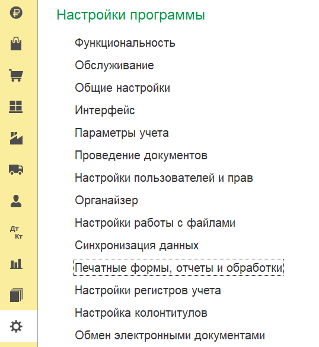
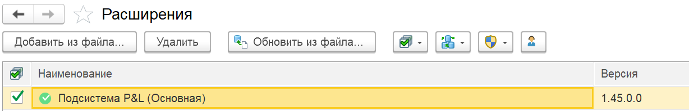

**Инструкция по отключению и удалению расширения P&L в 1С:Предприятие**

Расширение P&L -- это дополнительный модуль для управленческого учёта, реализованный в виде расширения конфигурации 1С. Оно не вносит изменений в основную конфигурацию и не мешает её обновлению. Если вам нужно временно скрыть функционал или полностью удалить расширение вместе с данными, выполните следующие шаги.

**Важно!** Перед удалением данных обязательно создайте резервную копию информационной базы. Это позволит восстановить информацию в случае ошибки или если данные потребуются позже.

### **Пошаговая инструкция**

#### **1\. Вход в раздел администрирования**

Запустите 1С:Предприятие в режиме «Предприятие» (с полными правами доступа). В главном меню или на рабочем столе выберите раздел **«Администрирование»**.

#### **2\. Переход к настройкам печатных форм и обработок**

В разделе администрирования найдите и откройте пункт **«Печатные формы, отчёты и обработки»**.

{width=538px height=586px}

#### **3\. Открытие списка расширений**

В открывшемся окне перейдите к группе настроек **«Расширения»**. Здесь отображаются все подключённые к базе расширения конфигурации.

#### **4\. Поиск расширения P&L**

В списке расширений найдите подсистему с названием, содержащим **«P&L основная»**.

{width=1228px height=199px}

#### **5\. Отключение расширения (без удаления данных)**

Если вы хотите временно скрыть функционал, но сохранить все накопленные данные:

-  Снимите флажок активности (самая первая колонка) напротив нужного расширения.

-  После этого подсистема перестанет отображаться в интерфейсе, однако все данные останутся в базе. При повторном включении расширение снова станет доступным с сохранённой информацией.

#### **6\. Полное удаление расширения (с очисткой данных)**

Если вы уверены, что расширение и его данные больше не нужны:

-  Выберите команду удаления (обычно кнопка **«Удалить»** или соответствующий пункт контекстного меню).

-  Подтвердите удаление. Система удалит все объекты расширения и связанные с ними данные.

   **Восстановление** после полного удаления возможно только из резервной копии базы.

#### **Примечание о восстановлении данных**

Если после удаления выяснилось, что данные необходимы, их можно восстановить, загрузив резервную копию базы, созданную до удаления. Также можно восстановить копию в отдельную информационную базу и выгрузить нужную информацию.