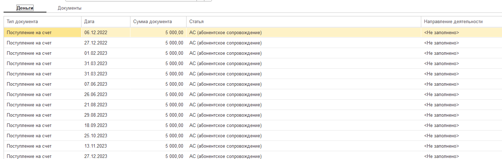

Закрыть возможность изменение документов в части влияние на финансовую отчетность

То есть если проведение документов не влияет на фин учет, то будет возможность провести документ. Иначе - нет.

Документ решает следующие задачи:

1. Распределение затрат на проекты или виды деятельности

2. Сохранение всех данных, на которых строится отчетность в отдельный регистр с целью поиска измененной информации и с целью выгрузки данных на уровне datalens

3. Создаст документы отчет ДДС, отчет ОПиУ, отчет Баланса

## Документ Распределение затрат

Назначение: распределить затраты по правилам.

Многостраничный режим документа. Мастер форма:

**1 Страница**

Настройки документа:

1. Организация (может быть пустой)

2. Период - указываем дату начала и дату окончания

3. Галочки: Распределять движение денежных средств (это все документы, которые отражены во вкладке ДЕНЬГИ), Распределять документы (накладные, акты, реализация)

4. Выбор режим распределения затрат: по проектам, по доп. аналитике.

Внизу будет таблица:

1. Список с галочками по доп аналитике

2. Список с галочками действующих проектов. Сверху должны отборы по статусу, организации

Правила распределения по проектам/ доп аналитике:

1. Пропорционально сумме проекта

2. Равномерно между проектами

3. Вручную

| Проект   | %   |
|----------|-----|
| Проект 1 | 20% |
| Проект 2 | 80% |

**2 Страница**

Перечень документов: Деньги, Документы

Сюда попадают все документы, по которым не указаны доп аналитика или проект (в зависимости от того, какой режим распределения мы выбрали)

**ОбщаяФорма.ХЛ\_ФормаЗаполненияРеквизитовПоДоговору**

{width=1405px height=447px}

**3 Страница**

Дерево из документов



---

*  **Документ 1.**

*  

*  

*  **Сумма**

---

*  

*  Проект 1.

*  % суммы

*  Сумма

---

*  

*  Проект 2.

*  % суммы

*  Сумма

---

*  **Документ 2.**

*  

*  

*  



**Должна быть кнопка Сохранить**

Логика работы документа:

1. Документ выбирает за период все движения денежных средств и исполнения обязательств, по которым не указан проект и доп аналитика.

2. В документе задаются правила распределения: по видам деятельности, по проектам.

### Техническая часть:

Регистр сведений ХЛ\_ПроводкиДокументовПоПравилам - он отвечает на вопрос, установлены правила или нет

Обязательно здесь должен быть сохранен документ **Распределения затрат**

Регистр сведений ХЛ\_РаспределениеДокументовПоПравилам

### Доработать вкладки деньги, документы

Виды распределения:

1. Автоматически

2. Вручную

3. По правилам

